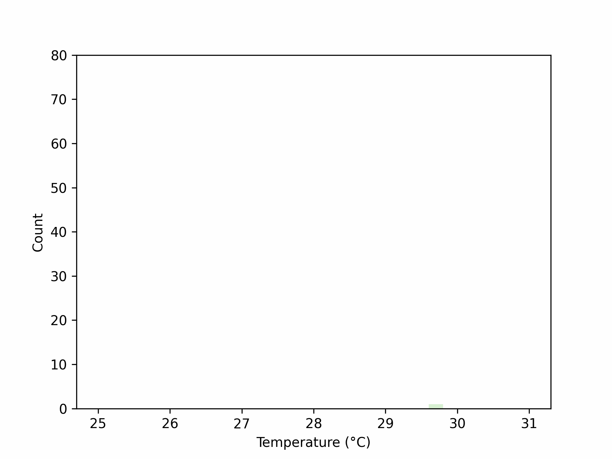

.. DO NOT EDIT.
.. THIS FILE WAS AUTOMATICALLY GENERATED BY SPHINX-GALLERY.
.. TO MAKE CHANGES, EDIT THE SOURCE PYTHON FILE:
.. "auto_examples\plot_animation_histogram_example.py"
.. LINE NUMBERS ARE GIVEN BELOW.

.. only:: html

    .. note::
        :class: sphx-glr-download-link-note

        :ref:`Go to the end <sphx_glr_download_auto_examples_plot_animation_histogram_example.py>`
        to download the full example code.

.. rst-class:: sphx-glr-example-title

.. _sphx_glr_auto_examples_plot_animation_histogram_example.py:

Animation Histogram Example
===================================

Example description

.. GENERATED FROM PYTHON SOURCE LINES 11-38

.. code-block:: Python

    from gerg_plotting.data_classes import Data
    from gerg_plotting.plotting_classes import Histogram, Animator
    import cmocean
    import numpy as np
    import matplotlib.pyplot as plt
    from pathlib import Path

    # Let's make some example data
    n_points = 10000
    data = Data(temperature=np.random.normal(28,size=n_points))

    # Let's create a histogram function to plot the data how we would like
    def make_hists(sample,color):
        '''Plot Histogram based on sample size and color'''
        data_sample = data[:10*sample+1]  # Slice data
        hist = Histogram(data_sample)  # Init histogram plotter
        hist.plot('temperature',color=color,bins=30,range=(25,31))  # Plot 1-d histogram
        hist.ax.set_ybound(upper=80)  # Set the ybounds maximum to 80 for a clearer plot
        return hist.fig

    samples = np.arange(90)
    cmap = plt.get_cmap('Greens')
    cmap = cmocean.tools.crop_by_percent(cmap,30,which='both')
    colors = [cmap((idx*2)+10) for idx in samples]

    gif_filename = Path('example_plots/animation_histogram_example.gif')
    Animator().animate(plotting_function=make_hists,param_dict={'sample':samples,'color':colors},fps=12,gif_filename=gif_filename)

.. _sphx_glr_download_auto_examples_plot_animation_histogram_example.py:

.. only:: html

  .. container:: sphx-glr-footer sphx-glr-footer-example

    .. container:: sphx-glr-download sphx-glr-download-jupyter

      :download:`Download Jupyter notebook: plot_animation_histogram_example.ipynb <plot_animation_histogram_example.ipynb>`

    .. container:: sphx-glr-download sphx-glr-download-python

      :download:`Download Python source code: plot_animation_histogram_example.py <plot_animation_histogram_example.py>`

    .. container:: sphx-glr-download sphx-glr-download-zip

      :download:`Download zipped: plot_animation_histogram_example.zip <plot_animation_histogram_example.zip>`

.. only:: html

 .. rst-class:: sphx-glr-signature

    `Gallery generated by Sphinx-Gallery <https://sphinx-gallery.github.io>`_
