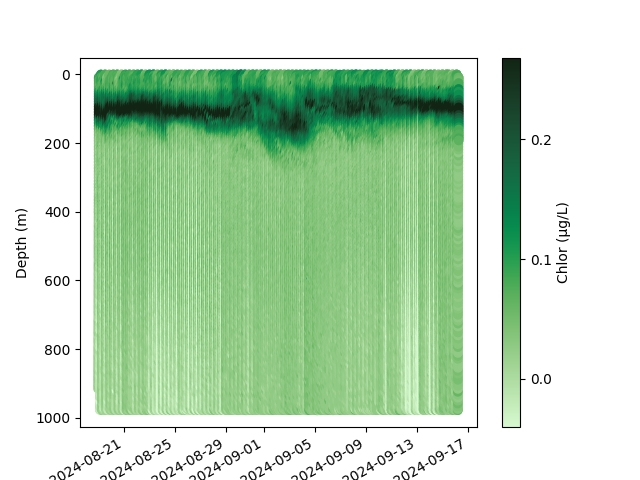

.. DO NOT EDIT.
.. THIS FILE WAS AUTOMATICALLY GENERATED BY SPHINX-GALLERY.
.. TO MAKE CHANGES, EDIT THE SOURCE PYTHON FILE:
.. "auto_examples\plot_data_from_netcdf_example.py"
.. LINE NUMBERS ARE GIVEN BELOW.

.. only:: html

    .. note::
        :class: sphx-glr-download-link-note

        :ref:`Go to the end <sphx_glr_download_auto_examples_plot_data_from_netcdf_example.py>`
        to download the full example code.

.. rst-class:: sphx-glr-example-title

.. _sphx_glr_auto_examples_plot_data_from_netcdf_example.py:

Data From Netcdf Example
===================================

How to use the data_from_netcdf function to load data from a netcdf file.
We also plot a hovmoller plot of chlorophyll 

.. GENERATED FROM PYTHON SOURCE LINES 12-24

.. code-block:: Python

    from gerg_plotting.tools import data_from_netcdf
    from gerg_plotting.plotting_classes import ScatterPlot

    data = data_from_netcdf("example_data/sample_glider_data.nc",
                            interp_glider=True)
    
    scatter = ScatterPlot(data)
    scatter.hovmoller('chlor')
    scatter.save('example_plots/data_from_netcdf_example.png')

.. _sphx_glr_download_auto_examples_plot_data_from_netcdf_example.py:

.. only:: html

  .. container:: sphx-glr-footer sphx-glr-footer-example

    .. container:: sphx-glr-download sphx-glr-download-jupyter

      :download:`Download Jupyter notebook: plot_data_from_netcdf_example.ipynb <plot_data_from_netcdf_example.ipynb>`

    .. container:: sphx-glr-download sphx-glr-download-python

      :download:`Download Python source code: plot_data_from_netcdf_example.py <plot_data_from_netcdf_example.py>`

    .. container:: sphx-glr-download sphx-glr-download-zip

      :download:`Download zipped: plot_data_from_netcdf_example.zip <plot_data_from_netcdf_example.zip>`

.. only:: html

 .. rst-class:: sphx-glr-signature

    `Gallery generated by Sphinx-Gallery <https://sphinx-gallery.github.io>`_
