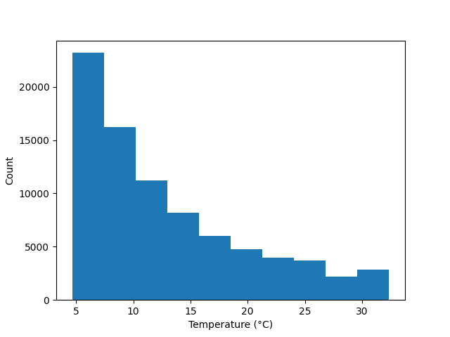

.. DO NOT EDIT.
.. THIS FILE WAS AUTOMATICALLY GENERATED BY SPHINX-GALLERY.
.. TO MAKE CHANGES, EDIT THE SOURCE PYTHON FILE:
.. "auto_examples\plot_data_object_example.py"
.. LINE NUMBERS ARE GIVEN BELOW.

.. only:: html

    .. note::
        :class: sphx-glr-download-link-note

        :ref:`Go to the end <sphx_glr_download_auto_examples_plot_data_object_example.py>`
        to download the full example code.

.. rst-class:: sphx-glr-example-title

.. _sphx_glr_auto_examples_plot_data_object_example.py:

Data Object Example
===================================

Example description

.. GENERATED FROM PYTHON SOURCE LINES 11-70

.. code-block:: Python

    from gerg_plotting.data_classes import Data, Variable
    from gerg_plotting.tools import data_from_csv
    import pandas as pd
    import cmocean

    # Load data from CSV file
    df = pd.read_csv('example_data/sample_glider_data.csv')

    # Method 1: Directly from CSV file (Easiest method)
    data = data_from_csv('example_data/sample_glider_data.csv')
    print("1. Created data object from CSV file")

    # Method 2: Create variables first, then make data object (Most control)
    # Create temperature variable with specific settings
    temperature = Variable(
        name='temperature',
        data=data['temperature'].data,
        units='°C',
        cmap=cmocean.cm.thermal,  # Color scheme for plotting
        vmin=-10,  # Minimum value for color scale
        vmax=40    # Maximum value for color scale
    )

    # Create salinity variable with specific settings
    salinity = Variable(
        name='salinity',
        data=data['salinity'].data,
        units='PSU',
        cmap=cmocean.cm.haline,  # Special color scheme for salinity
        vmin=28,
        vmax=40
    )

    # Create new data object with our custom variables
    custom_data = Data(
        temperature=temperature,
        salinity=salinity
    )
    print("2. Created data object with custom variables")

    # Method 3: Add variables to existing data object
    # Create a new variable for Turner angle
    Turner_angle = Variable(
        name='Turner_angle',
        data=df['Turner_angle'],
        units='degrees',
    )

    # Add the new variable to our data object
    custom_data.add_custom_variable(Turner_angle)
    print("3. Added custom variable to existing data object")

    # Make a simple plot to show our data
    from gerg_plotting.plotting_classes.histogram import Histogram
    plot = Histogram(custom_data)
    plot.plot('temperature')
    plot.save('example_plots/data_object_example.png')
    print("Created example plot: simple_temperature_histogram.png")

.. _sphx_glr_download_auto_examples_plot_data_object_example.py:

.. only:: html

  .. container:: sphx-glr-footer sphx-glr-footer-example

    .. container:: sphx-glr-download sphx-glr-download-jupyter

      :download:`Download Jupyter notebook: plot_data_object_example.ipynb <plot_data_object_example.ipynb>`

    .. container:: sphx-glr-download sphx-glr-download-python

      :download:`Download Python source code: plot_data_object_example.py <plot_data_object_example.py>`

    .. container:: sphx-glr-download sphx-glr-download-zip

      :download:`Download zipped: plot_data_object_example.zip <plot_data_object_example.zip>`

.. only:: html

 .. rst-class:: sphx-glr-signature

    `Gallery generated by Sphinx-Gallery <https://sphinx-gallery.github.io>`_
