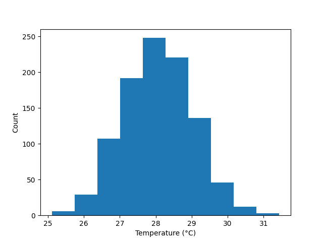

.. DO NOT EDIT.
.. THIS FILE WAS AUTOMATICALLY GENERATED BY SPHINX-GALLERY.
.. TO MAKE CHANGES, EDIT THE SOURCE PYTHON FILE:
.. "auto_examples\plot_simple_histogram_example.py"
.. LINE NUMBERS ARE GIVEN BELOW.

.. only:: html

    .. note::
        :class: sphx-glr-download-link-note

        :ref:`Go to the end <sphx_glr_download_auto_examples_plot_simple_histogram_example.py>`
        to download the full example code.

.. rst-class:: sphx-glr-example-title

.. _sphx_glr_auto_examples_plot_simple_histogram_example.py:

Simple Histogram Example
===================================

Example description

.. GENERATED FROM PYTHON SOURCE LINES 11-27

.. code-block:: Python

    from gerg_plotting.plotting_classes import Histogram
    from gerg_plotting.data_classes import Data
    import numpy as np

    # If you just want to look at the histogram:
    data = Data(temperature=np.random.normal(28,size=1000))

    Histogram(data).plot(var='temperature')

    # If you want to save the histogram figure:
    data = Data(temperature=np.random.normal(28,size=1000))

    hist = Histogram(data)  # Assign the histogram plotter to a variable
    hist.plot(var='temperature')

    hist.fig.savefig('example_plots/simple_histogram_example.png')  # Get the fig attribute from hist then the savefig method to save it

.. _sphx_glr_download_auto_examples_plot_simple_histogram_example.py:

.. only:: html

  .. container:: sphx-glr-footer sphx-glr-footer-example

    .. container:: sphx-glr-download sphx-glr-download-jupyter

      :download:`Download Jupyter notebook: plot_simple_histogram_example.ipynb <plot_simple_histogram_example.ipynb>`

    .. container:: sphx-glr-download sphx-glr-download-python

      :download:`Download Python source code: plot_simple_histogram_example.py <plot_simple_histogram_example.py>`

    .. container:: sphx-glr-download sphx-glr-download-zip

      :download:`Download zipped: plot_simple_histogram_example.zip <plot_simple_histogram_example.zip>`

.. only:: html

 .. rst-class:: sphx-glr-signature

    `Gallery generated by Sphinx-Gallery <https://sphinx-gallery.github.io>`_
